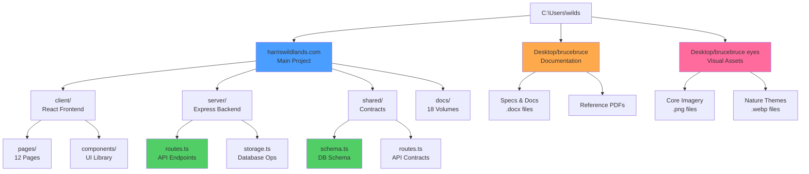

# C:\Users\wilds Directory Map

> **Purpose:** Obsidian-friendly visual map of your complete directory structure
> **Last Updated:** 2026-01-03
> **Root Path:** `C:\Users\wilds`

---

## 🗺️ Quick Navigation

- [[#harriswildlands-projects|HarrisWildlands Projects]] - Main project folders
- [[#development-tools|Development Tools]] - Config and tools
- [[#documentation|Documentation & Assets]] - Docs and media
- [[#system-directories|System Directories]] - Windows folders

---

## 📂 Directory Overview

```
C:\Users\wilds\
├── 🚀 HARRISWILDLANDS PROJECTS (Main Work)
│   ├── harriswildlands.com/          [Primary full-stack app]
│   ├── HARRISWILDLANDS/               [Additional project files]
│   ├── harriswildlands_ai_bridge/     [AI integration layer]
│   └── harris_wildlands_core/         [Core system files]
│
├── 📝 DOCUMENTATION & ASSETS
│   ├── Desktop/
│   │   ├── brucebruce/                [Core documentation & specs]
│   │   └── brucebruce eyes/           [Visual assets & imagery]
│   └── Documents/
│
├── 🔧 DEVELOPMENT & CONFIG
│   ├── .config/                       [Application configs]
│   ├── .obsidian/                     [Obsidian vault settings]
│   └── thoughtweaver/                 [ThoughtWeaver project]
│
└── 💻 SYSTEM DIRECTORIES
    ├── AppData/
    ├── Downloads/
    └── [Standard Windows folders]
```

---

## 🚀 HarrisWildlands Projects

### `harriswildlands.com/` - Primary Application

**Type:** Full-stack TypeScript web application  
**Framework:** React + Vite (frontend) + Express (backend)  
**Database:** PostgreSQL + Drizzle ORM  
**Status:** Active development

#### Directory Structure
```
harriswildlands.com/
├── client/                    # Frontend React application
│   ├── src/
│   │   ├── pages/            # All page components (12 pages)
│   │   │   ├── BruceOps.tsx         → Landing/orientation
│   │   │   ├── Dashboard.tsx        → Overview dashboard
│   │   │   ├── LifeOps.tsx          → Daily logging
│   │   │   ├── ThinkOps.tsx         → Idea capture
│   │   │   ├── Goals.tsx            → Goal tracking
│   │   │   ├── WeeklyReview.tsx     → Weekly synthesis
│   │   │   ├── Settings.tsx         → User settings
│   │   │   ├── TeachingAssistant.tsx → Teaching tools
│   │   │   ├── HarrisWildlands.tsx  → Content generator
│   │   │   ├── Chat.tsx             → AI chat
│   │   │   ├── RealityCheck.tsx     → Idea validation
│   │   │   └── not-found.tsx        → 404 page
│   │   │
│   │   ├── components/       # Reusable UI components
│   │   │   ├── Layout.tsx
│   │   │   ├── InterfaceOverlay.tsx
│   │   │   ├── BotanicalMotifs.tsx
│   │   │   └── ui/          # 50+ shadcn/ui components
│   │   │
│   │   ├── hooks/           # Custom React hooks
│   │   │   ├── use-auth.ts
│   │   │   ├── use-demo.tsx
│   │   │   └── use-bruce-ops.ts
│   │   │
│   │   └── lib/             # Utilities
│   │       ├── queryClient.ts
│   │       └── utils.ts
│   │
│   └── public/              # Static assets
│       └── assets/img/      # Visual imagery
│
├── server/                   # Backend Express API
│   ├── index.ts             # Server entry point
│   ├── routes.ts            # ⭐ ALL API endpoints (850+ lines)
│   ├── storage.ts           # Database operations (800+ lines)
│   ├── db.ts                # Database connection
│   ├── google-drive.ts      # Drive integration
│   └── replit_integrations/
│       └── auth/            # Authentication system
│
├── shared/                   # Shared contract layer
│   ├── schema.ts            # ⭐ Database schema (500+ lines)
│   ├── routes.ts            # ⭐ API contracts (400+ lines)
│   └── models/
│       └── auth.ts          # Auth models
│
├── docs/                     # Complete documentation
│   ├── manual/              # 18-volume technical manual
│   │   ├── TECHNICAL_MANUAL.md
│   │   ├── VOL01_EXECUTIVE_OVERVIEW.md
│   │   ├── VOL05_DATABASE_SCHEMA.md     ⭐ All tables
│   │   ├── VOL06_API_CATALOG.md         ⭐ All endpoints
│   │   └── ... (14 more volumes)
│   │
│   ├── 00-start-here/       # Getting started
│   ├── 10-user-guide/       # End-user docs
│   ├── 20-operator-guide/   # Deployment & ops
│   ├── 30-developer-reference/ # Technical ref
│   └── 40-protocols-and-governance/ # System principles
│
├── release/                  # Deployment packages
│   ├── harriswildlands-prod-bundle.zip
│   ├── harriswildlands-source.zip
│   └── CHECKLIST.md
│
├── script/                   # Build scripts
│   ├── build.ts
│   └── seed.ts
│
├── HarrisWildlands_UIKit_v1/ # Design system
│   ├── Docs/
│   └── Code_Snippets/
│
├── attached_assets/          # Historical context files
│
├── package.json              # Dependencies
├── tsconfig.json             # TypeScript config
├── vite.config.ts            # Vite bundler
├── tailwind.config.ts        # Tailwind CSS
├── drizzle.config.ts         # Database ORM
├── Dockerfile                # Container build
├── docker-compose.yml        # Multi-container
├── .replit                   # Replit deployment
└── .env.example              # Environment template
```

**Key Files for AI Collaboration:**
- `server/routes.ts` - All API implementations
- `shared/schema.ts` - Complete database schema
- `shared/routes.ts` - API type contracts
- `docs/manual/VOL05_DATABASE_SCHEMA.md` - Schema documentation
- `docs/manual/VOL06_API_CATALOG.md` - API documentation

---

### `HARRISWILDLANDS/` - Additional Project Files

**Type:** Supplementary project resources  
**Status:** Reference/archive

*(Explore with file browser for specific contents)*

---

### `harriswildlands_ai_bridge/` - AI Integration Layer

**Type:** AI system integration code  
**Purpose:** Bridge between HarrisWildlands and AI services

*(Explore with file browser for specific contents)*

---

### `harris_wildlands_core/` - Core System Files

**Type:** Core system components  
**Purpose:** Foundational utilities and libraries

*(Explore with file browser for specific contents)*

---

## 📝 Documentation & Assets

### `Desktop/brucebruce/` - Core Documentation

**Type:** Word documents and PDFs  
**Contents:** Project specifications and master sheets

```
brucebruce/
├── 📄 Artifacts LIFEOPS.docx
├── 📄 Artifacts THINKOPS.docx
├── 📄 Atlas v1.0.docx
├── 📄 Base System v1.0.docx
├── 📄 Daily Log Prompt v1.0.docx
├── 📄 Life Operations Steward — Core Processing Protocol.docx
├── 📄 LifeOps_Goal_Tracking_Spec_MVP_to_Pro.docx
│
├── 📁 brucebruce data/          # Data files and exports
│
└── 📕 Reference PDFs
    ├── Chelbie_Joseph_OnTrack_Playbook.pdf
    ├── coach harris.pdf
    ├── CuriousAI.pdf
    ├── harris clan.pdf
    ├── parents playbook.pdf
    └── science_instructional_planning_guide.docx
```

**Purpose:** 
- Project specifications and requirements
- System design documents
- User workflow definitions
- Reference materials

---

### `Desktop/brucebruce eyes/` - Visual Assets

**Type:** Image files (PNG, WEBP, JPG)  
**Contents:** UI imagery, generated graphics, design assets

```
brucebruce eyes/
├── 🎨 Core Imagery
│   ├── bruceops.png
│   ├── bruceops core.png
│   ├── harriswildlands image core.png
│   ├── lifeops core.png
│   ├── thinkops core.png
│   └── shared system utilities image core.png
│
├── 🌲 Nature Themes (WEBP)
│   ├── canopy.webp / canopy2.webp
│   ├── forest.webp / forest2.webp
│   ├── root.webp / root2.webp
│   ├── trunk.webp / trunk2.webp
│   ├── systems.webp / systems2.webp
│   └── harriswildlands.webp / harriswildlands2.webp
│
└── 🤖 AI Generated Images
    ├── ChatGPT Image Dec 25, 2025 (multiple).png
    ├── DALL·E 2025-12-26 (cross design).webp
    ├── DALL·E 2025-12-27 (forest dashboard).webp
    ├── galaxyai-image.jpg
    └── generated-image-1 through generated-image-4 (variants).png
```

**Purpose:**
- Visual branding elements
- UI background imagery
- Icon and logo designs
- Thematic decorations

---

## 🔧 Development & Config

### `.config/` - Application Configurations

**Type:** Configuration files  
**Purpose:** App settings and preferences

---

### `.obsidian/` - Obsidian Vault Settings

**Type:** Obsidian configuration  
**Purpose:** Vault plugins, themes, and settings

---

### `thoughtweaver/` - ThoughtWeaver Project

**Type:** Related project  
**Purpose:** Connected system or utility

*(Explore for specific implementation)*

---

## 💻 System Directories

### Standard Windows Folders

```
├── 3D Objects/          # Windows 3D content
├── Contacts/            # Windows contacts
├── Desktop/             # ⭐ Your desktop (see above)
├── Documents/           # Personal documents
├── Downloads/           # Downloaded files
├── Favorites/           # Browser favorites
├── Links/               # Windows quick links
├── Music/               # Audio files
├── Pictures/            # Image collection
├── Videos/              # Video files
├── Saved Games/         # Game saves
└── Searches/            # Saved searches
```

---

## 🎯 Most Important Directories (Starred)

### For Development Work
1. **`harriswildlands.com/`** - Primary codebase
2. **`harriswildlands.com/server/routes.ts`** - API implementations
3. **`harriswildlands.com/shared/schema.ts`** - Database schema
4. **`harriswildlands.com/docs/manual/`** - Technical documentation

### For Documentation
1. **`Desktop/brucebruce/`** - Specifications and requirements
2. **`harriswildlands.com/docs/`** - Technical manuals
3. **`harriswildlands.com/release/`** - Release notes and checklists

### For Assets
1. **`Desktop/brucebruce eyes/`** - Visual imagery
2. **`harriswildlands.com/client/public/assets/`** - Web assets
3. **`harriswildlands.com/HarrisWildlands_UIKit_v1/`** - Design system

---

## 📊 Statistics

### harriswildlands.com Project
- **Total Files:** ~120+ source files
- **Total Lines:** ~20,500 (code + docs)
- **Languages:** TypeScript (95%), CSS (3%), Config (2%)
- **Key Dependencies:** React, Express, Drizzle ORM, TanStack Query, Tailwind CSS

### Documentation
- **Word Documents:** 12+ specification files
- **Markdown Docs:** 30+ technical documents
- **PDF References:** 6+ reference guides
- **Images:** 50+ design assets

---

## 🔗 Related Files & Links

### Configuration Files in Root
- `.bash_history` - Command history
- `.gitconfig` - Git configuration
- `curl` - cURL executable

### Hidden Directories
- `.config/` - App configurations
- `.idlerc/` - Python IDLE config
- `.obsidian/` - Obsidian settings
- `.ollama/` - Ollama AI config

---

## 🎨 Visual Diagram (Mermaid)



---

## 🚀 Quick Actions

### Open Key Locations in File Explorer
```bash
# Main project
explorer.exe "C:\Users\wilds\harriswildlands.com"

# Documentation
explorer.exe "C:\Users\wilds\Desktop\brucebruce"

# Visual assets
explorer.exe "C:\Users\wilds\Desktop\brucebruce eyes"
```

### Navigate in Terminal
```bash
# Go to main project
cd C:\Users\wilds\harriswildlands.com

# Go to documentation
cd C:\Users\wilds\Desktop\brucebruce

# Go to assets
cd "C:\Users\wilds\Desktop\brucebruce eyes"
```

---

## 📝 Notes & Observations

### Project Organization
- ✅ Well-structured mono-repo (harriswildlands.com)
- ✅ Comprehensive documentation (18-volume manual)
- ✅ Separate documentation and asset folders
- ✅ Clear separation of concerns (client/server/shared)

### Opportunities
- 📁 Multiple HarrisWildlands folders could be consolidated
- 📚 Desktop documentation could be moved into main project
- 🎨 Visual assets could be integrated into project structure
- 🔄 AI bridge and core could be submodules of main project

---

## 🔍 Search Tips

### Find Files Quickly in Obsidian
```
# Find all TypeScript files
path:.ts

# Find all documentation
path:.md

# Find all configurations
path:config

# Find API-related files
file:routes

# Find database-related files
file:schema OR file:storage
```

---

## 🏷️ Tags Reference

Use these tags to navigate your vault:

- `#harriswildlands` - Main project
- `#lifeops` - LifeOps lane/module
- `#thinkops` - ThinkOps lane/module
- `#bruceops` - BruceOps orientation
- `#api` - API-related files
- `#database` - Database schema/operations
- `#documentation` - Documentation files
- `#assets` - Visual assets
- `#deployment` - Deployment configs

---

**Last Updated:** 2026-01-03  
**Maintained By:** Bruce  
**Purpose:** Complete directory reference for Obsidian navigation
